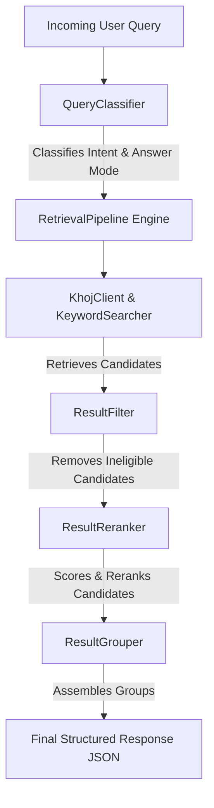

# MyAPI Smart Retrieval: Architectural Audit & Developer's Debugging Guide

Welcome to the **MyAPI Developer's Guide**. This document is designed to take you from a high-level conceptual understanding of the codebase down to the exact debugging techniques, tools, and workflows you can use to audit, trace, and troubleshoot MyAPI like a senior software engineer.

---

## 1. High-Level Architectural Map

MyAPI is a **Smart Retrieval Pipeline** built on top of a local/remote vector search engine (Khoj). Instead of relying on raw vector similarity—which frequently fails when you want to retrieve specific documents or organize logs chronologically—MyAPI layers a modular pipeline written in clean, dependency-conscious Python.



### The Three Pipeline Stages

1. **Classification (The Brain)**: 
   * **Component**: [context_refinery/retrieval.py:QueryClassifier](file:///Users/saboor/repos/MyAPI/context_refinery/retrieval.py#L340)
   * **Action**: Analyzes query keywords and phrases via efficient regular expressions (no heavy LLM calls required). It categorizes the intent (e.g., `temporal`, `operational`, `project_overview`, `factual`) and dictates how search results should be sorted.
2. **Retrieval (The Harvester)**:
   * **Component**: [context_refinery/retrieval.py:KhojClient](file:///Users/saboor/repos/MyAPI/context_refinery/retrieval.py#L27) & [context_refinery/retrieval.py:KeywordSearcher](file:///Users/saboor/repos/MyAPI/context_refinery/retrieval.py#L234)
   * **Action**: Fetches candidate documents. It combines semantic search (dense embeddings from Khoj) with keyword search (sparse matching from the markdown corpus) to ensure both context and exact names/phrases can be found.
3. **Refinement (The Editor)**:
   * **Component**: [context_refinery/retrieval.py:ResultFilter](file:///Users/saboor/repos/MyAPI/context_refinery/retrieval.py#L517) & [context_refinery/retrieval.py:ResultReranker](file:///Users/saboor/repos/MyAPI/context_refinery/retrieval.py#L565)
   * **Action**: Wipes out unqualified documents (filtering by tags, projects, date ranges). Then, it calculates a compound score using semantic match, date recency, document-kind priors, title matches, and exact phrase boosts, returning the best-ordered documents.

---

## 2. Codebase Deep-Dive: Key Modular Components

To debug the code, you need to know where the levers are. Below is an audit of the core classes in `context_refinery`.

### Metadata Parser (`MetadataParser`)
* **File**: [context_refinery/retrieval.py](file:///Users/saboor/repos/MyAPI/context_refinery/retrieval.py#L57)
* **What it does**: Strips YAML frontmatter from document bodies. Crucially, it infers a `document_kind` for every item using filename and title regex checks:
  * `daily_note`: File named like `obsidian-YYYYMMDD.md`
  * `benchmark_artifact`: Filenames containing `benchmark`, `harness`, or `eval`
  * `operational_dump`: Outputs from terminal sessions, Claude Code, or Codex logs
  * `synthesized_note`: Hand-curated logs or summary briefings
  * `reference_doc` / `scratch_log`: Standard technical docs or raw dumps

### Result Reranker (`ResultReranker`)
* **File**: [context_refinery/retrieval.py](file:///Users/saboor/repos/MyAPI/context_refinery/retrieval.py#L565)
* **What it does**: Reranks documents dynamically using a weighted formula. The weights shift based on the query's **intent**:
  ```python
  # Default weights
  W_SEMANTIC = 0.34
  W_RECENCY = 0.16
  W_TRUST = 0.10
  W_REINFORCE = 0.08
  W_KEYWORD = 0.12
  W_SOURCE = 0.14
  W_TITLE = 0.18
  ```
  * *Example*: If the query classifier identifies a **temporal** intent ("what did I do yesterday?"), `W_RECENCY` scales up to `0.46` while `W_SEMANTIC` drops to `0.24`. This guarantees timeline notes stay at the top.

### Path-Based Normalization (`normalization_schema`)
* **File**: [context_refinery/normalization_schema.py](file:///Users/saboor/repos/MyAPI/context_refinery/normalization_schema.py)
* **What it does**: Holds the deterministic mapping policies. Instead of running LLM classification on all 30k notes during ingestion, the system maps files to metadata based on their relative POSIX directory path:
  * Files in `handoffs/` → `source_type: handoff`
  * Files in `project-docs/` or `01 Projects/` → `source_type: project_doc`
  * Files in `Templates/` → `source_type: config`

---

## 3. How to Debug & Hunt Bugs (Step-by-Step)

Imagine you discover a bug: **Notes inside a folder are getting indexed with the wrong source type.** As a developer, how do you locate, trace, and repair this?

### Step 1: Use Ripgrep (`rg`) in Neovim or Ghostty
If you suspect an issue in the "inference" logic but don't know where the file is, run a ripgrep search from the root of your repository:

`Run on Mac:`
```bash
rg "def infer_"
```

This instantly returns:
```text
context_refinery/normalization_schema.py:98:def infer_source_type(path: str, adapter: Optional[str] = None) -> str:
context_refinery/normalization_schema.py:124:def infer_temporal_mode(source_type: str) -> str:
context_refinery/normalization_schema.py:139:def infer_primary_project(path: str, title: Optional[str] = None) -> str:
```

### Step 2: Open Neovim and Trace the Function
Open `context_refinery/normalization_schema.py` in Neovim. Look at how `infer_source_type` resolves directories:
```python
_PATH_TO_SOURCE_TYPE: tuple[tuple[str, str], ...] = (
    ("source-of-truth-anchors/", "anchor"),
    ("handoffs/", "handoff"),
    ("/Daily/", "daily_note"),
    # ...
)
```
If you added a new directory called `06 Reference/` and it is incorrectly falling back to `"note"`, you would edit `_PATH_TO_SOURCE_TYPE` to map `"06 Reference/"` to `"reference"`.

### Step 3: Run the Test Suite in the Virtual Environment
Before making any changes, you must ensure you have a baseline. Never use global python for testing here—always use the project virtual environment.

`Run on Mac:`
```bash
venv/bin/pytest tests/test_normalization_schema.py
```

If you modify the source mapping, add a new test case in `tests/test_normalization_schema.py` under the appropriate parameterization block, then run the tests to confirm it works perfectly.

---

## 4. Querying the Live VM (Remote Testing)

Your Google Cloud VM (`khoj-vm-new` at `100.85.100.52`) is currently **active and running** both Khoj and Context Refinery. You can run manual checks directly from your Mac terminal to verify how queries flow through the pipeline.

### Check Service Status
Verify if both background systemd units are fully operational on the VM:

`Run on Mac:`
```bash
ssh khoj-vm-new "systemctl status khoj.service context-refinery.service"
```

### Query Context Refinery Directly
We can send a live POST request to Context Refinery's HTTP `/query` endpoint on the VM. This forces it to parse a query, classify it, retrieve it via Khoj, and rerank it:

`Run on Mac:`
```bash
ssh khoj-vm-new "curl -sS -X POST http://localhost:8000/query \
  -H 'Content-Type: application/json' \
  -d '{\"q\":\"What is GDDP?\",\"n\":1}'" | python3 -m json.tool
```

#### What the response teaches us:
* `"classification"` shows you how the `QueryClassifier` ran on the VM:
  ```json
  "classification": {
      "intent": "factual",
      "answer_mode": "lookup",
      "confidence": 0.5
  }
  ```
* `"results"` displays the final scored candidates output by the `ResultReranker`, complete with their calculated `final_score` (e.g., `0.637`).

---

## 5. Senior Developer Takeaways

1. **Deterministic over Stochastic**: Don't use a large language model to parse frontmatter or guess paths when simple, fast, and 100% accurate regex patterns (`_PATH_TO_SOURCE_TYPE`) can do it for free.
2. **Intent-Driven Reranking**: Vector distance (`khoj_score`) is only half the battle. In practical RAG systems, tuning your results by date, trust flags, and metadata matching yields dramatically better quality than raw semantic embeddings alone.
3. **Locality First**: When debugging, start by checking your unit tests locally (`venv/bin/pytest`) before uploading or running remote tests against live service instances. It saves time and isolates network/VM-state noise.
