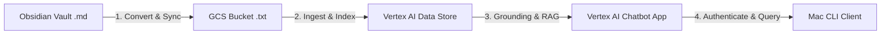

# Guide: Building a Vertex AI Chatbot over the SoloDeveloper Vault

> **Status: implemented.** The live deployment uses engine `notes-chatbot` (Dialogflow CX agent "Ask My Notes (Chatbot)") backed by data store `all-notes-chat`. The name placeholders below (`solodeveloper-chatbot`, `solodeveloper-vault-store`) are guide-template defaults; the steps themselves are accurate.

This document provides a step-by-step, end-to-end walkthrough for deploying a conversational chatbot over your **SoloDeveloper** Obsidian vault using Google Cloud Vertex AI Search and Conversation. This setup enables you to leverage your GCP generative AI credits to query your personal notes via Google's enterprise-grade Gemini models.

---

## 📋 Architectural Overview

The workflow splits your retrieval pipeline into four main layers:



---

## 🛠️ Step 1: Local Setup & GCS Syncing

Vertex AI does not natively parse raw markdown file formats (`.md`) efficiently. To satisfy Google’s MIME-type detection, we must convert our markdown files to plain text (`.txt`) and synchronize them to your Google Cloud Storage bucket.

### 1. View the Sync Script
Your local script [upload_as_txt.py](file:///Users/saboor/repos/MyAPI/scratch/upload_as_txt.py) is configured to handle this automatically:
* **Local Source**: `/Users/saboor/Obsidian/SoloDeveloper`
* **Destination Bucket**: `gs://sb-myapi-corpus/obsidian/SoloDeveloper`

### 2. Run the Sync Command
Execute the script from your Mac terminal to convert and upload your notes:
```bash
python3 scratch/upload_as_txt.py
```

* **What it does**: 
  1. Creates a clean local temporary staging folder.
  2. Copies all `.md` files to the staging folder while changing their extension to `.txt`.
  3. Copies all `.pdf` documents as-is.
  4. Runs `gsutil -m rsync -d -r` to upload the new/edited files and purge deleted files from GCS incrementally.

---

## ☁️ Step 2: Creating the Vertex AI Data Store

Once your data is uploaded to GCS, you must index it in a Vertex AI Data Store.

1. Open your browser and go to the [Google Cloud Console](https://console.cloud.google.com/).
2. Select your project: **`sb-genai-2026`**.
3. Search for and navigate to **Vertex AI Agent Builder** (formerly Search and Conversation).
4. In the left navigation menu, click **Data Stores** and then click **Create Data Store**.
5. Select **Cloud Storage** as your data source.
6. Configure the Cloud Storage settings:
   * **Folder Path**: Select your bucket prefix path: `gs://sb-myapi-corpus/obsidian/SoloDeveloper/**`
   * **Import Type**: Choose **Unstructured documents** (e.g., text, HTML, PDF).
   * Click **Continue**.
7. Configure the schema/indexing settings:
   * Keep the defaults (which uses standard enterprise OCR and document parsing).
8. Name your Data Store:
   * **Data Store Name**: `solodeveloper-vault-store` *(actual name in this deployment: `all-notes-chat`)*
   * Click **Create**.
   * *Note: It will take a few minutes for Vertex AI to fully index your 1,700 uploaded files.*

---

## 🤖 Step 3: Creating the Chatbot App

With the Data Store ready, you will link it to a conversational chatbot interface.

1. In the **Vertex AI Agent Builder** console, navigate to **Apps** in the left menu.
2. Click **Create App** or **New App**.
3. Select **Chat** as the application type.
4. Fill in the global App Details:
   * **App Name**: `solodeveloper-chatbot` *(actual name in this deployment: `notes-chatbot`)*
   * **Company/Organization Name**: `SoloDeveloper`
   * Click **Continue**.
5. Under **Data Stores**, check the box next to your newly created `solodeveloper-vault-store` *(actual: `all-notes-chat`)*.
6. Click **Create**.

---

## 💻 Step 4: Querying from the Local Terminal

To query your new chatbot from your Mac terminal without dealing with raw API JSON payloads, update your CLI client.

1. Open your local client file: [vertex_client.py](file:///Users/saboor/repos/MyAPI/scratch/vertex_client.py)
2. In the `run_chat` function (around line 75), the endpoint URL points at the engine ID. In this deployment it stays as `notes-chatbot`:
   ```python
   url = f"https://discoveryengine.googleapis.com/v1/projects/{PROJECT_ID}/locations/global/collections/default_collection/engines/notes-chatbot/servingConfigs/default_search:answer"
   ```
3. Authenticate your gcloud session on your Mac (ensuring it matches the account loaded in the script):
   ```bash
   gcloud auth login sbkchaudry@gmail.com
   ```
4. Query your vault directly from your terminal:
   ```bash
   python3 scratch/vertex_client.py chat "What did I decide regarding vault schema V4?"
   ```

*Vertex AI will search your notes on GCS, extract the relevant context, and return a grounded, conversational answer using your Google Cloud credits.*
